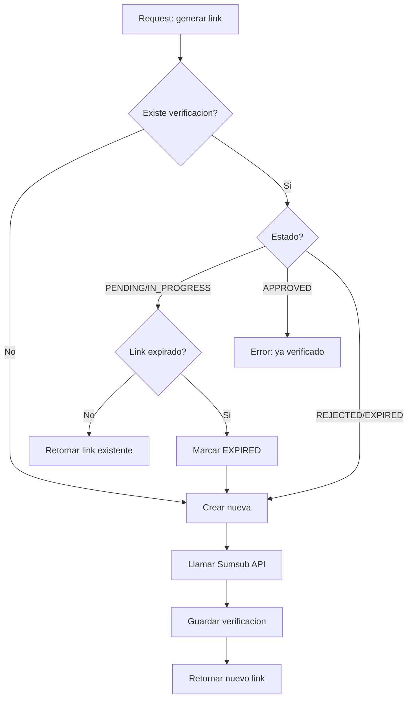
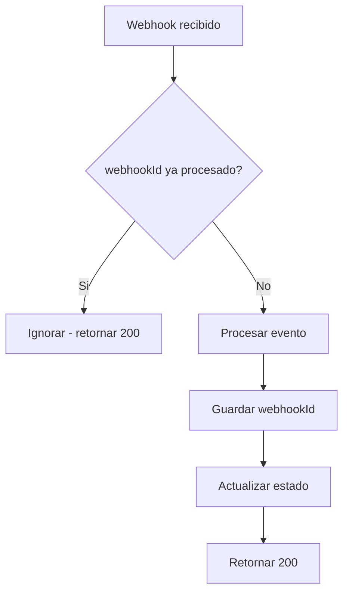
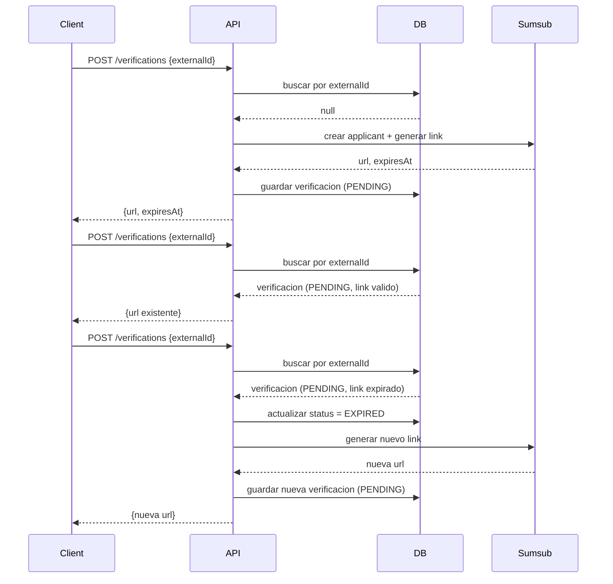

# Anti-duplicacion e Idempotencia - KYB

> **Version**: 1.0.0 | **Estado**: Draft

## 1. Regla Principal

```
┌────────────────────────────────────────────────────┐
│  1 verificacion activa por externalId (empresa)   │
└────────────────────────────────────────────────────┘
```

**Clave de idempotencia**: `externalId` (ID de empresa en nuestro sistema)

### Proteccion de Sumsub (built-in)

Sumsub tiene proteccion adicional a nivel de sesion:

```
┌─────────────────────────────────────────────────────────────────┐
│  Si un permalink con externalId ya tiene sesion activa,         │
│  Sumsub BLOQUEA apertura en otra pestana/navegador/dispositivo  │
└─────────────────────────────────────────────────────────────────┘
```

**Capas de proteccion:**

| Capa | Responsable | Proteccion |
|------|-------------|------------|
| 1. API | Nosotros | 1 verificacion activa por empresa |
| 2. BD | Nosotros | Constraint unico en estados activos |
| 3. Sesion | Sumsub | Bloquea multiples sesiones simultaneas |

Esto significa que aunque un usuario comparta el link, solo una persona puede estar activamente verificando a la vez.

---

## 2. Estados Activos vs Inactivos

| Estado | Activo? | Permite nueva? |
|--------|:-------:|:--------------:|
| `PENDING` | Si | No |
| `IN_PROGRESS` | Si | No |
| `APPROVED` | No (final) | No |
| `REJECTED` | No (final) | Si |
| `EXPIRED` | No | Si |

---

## 3. Logica de Generacion de Link



### Pseudocodigo

```typescript
async function getOrCreateVerificationLink(externalId: string, country: CountryCode): Promise<VerificationLink> {

  // 1. Buscar verificacion existente
  const existing = await repository.findByExternalId(externalId);

  // 2. Si no existe, crear nueva
  if (!existing) {
    return createNewVerification(externalId, country);
  }

  // 3. Evaluar estado
  switch (existing.status) {

    case 'APPROVED':
      throw new Error('Empresa ya verificada');

    case 'PENDING':
    case 'IN_PROGRESS':
      // Verificar si link sigue valido
      if (existing.urlExpiresAt > new Date()) {
        return existing.verificationUrl; // Retornar existente
      }
      // Link expirado -> marcar y crear nuevo
      await repository.updateStatus(existing.id, 'EXPIRED');
      return createNewVerification(externalId, country);

    case 'REJECTED':
    case 'EXPIRED':
      // Permitir nueva verificacion
      return createNewVerification(externalId, country);
  }
}
```

---

## 4. Constraint de Base de Datos

```sql
-- Solo 1 verificacion activa por empresa
CREATE UNIQUE INDEX idx_one_active_per_company
ON business_verifications (external_id)
WHERE status IN ('PENDING', 'IN_PROGRESS');
```

---

## 5. Idempotencia en Webhooks

### Problema
Sumsub puede enviar el mismo webhook multiples veces (reintentos, duplicados).

### Solucion
Guardar `webhookId` de cada evento procesado.



### Tabla de Webhooks Procesados

```sql
CREATE TABLE processed_webhooks (
  webhook_id VARCHAR(100) PRIMARY KEY,
  external_id VARCHAR(100) NOT NULL,
  event_type VARCHAR(50) NOT NULL,
  processed_at TIMESTAMP DEFAULT NOW()
);

-- Limpiar webhooks viejos (opcional, cron job)
-- DELETE FROM processed_webhooks WHERE processed_at < NOW() - INTERVAL '7 days';
```

### Pseudocodigo

```typescript
async function handleWebhook(payload: SumsubWebhook): Promise<void> {
  const webhookId = payload.correlationId || payload.applicantId + '_' + payload.type;

  // 1. Verificar si ya se proceso
  const alreadyProcessed = await webhookRepo.exists(webhookId);
  if (alreadyProcessed) {
    return; // Ignorar duplicado
  }

  // 2. Procesar
  const status = mapSumsubStatus(payload);
  await verificationRepo.updateStatus(payload.externalUserId, status);

  // 3. Marcar como procesado
  await webhookRepo.save({
    webhookId,
    externalId: payload.externalUserId,
    eventType: payload.type
  });
}
```

---

## 6. Diagrama de Secuencia Completo



---

## 7. Resumen de Reglas

| Escenario | Accion |
|-----------|--------|
| No existe verificacion | Crear nueva |
| Existe PENDING con link valido | Retornar existente |
| Existe PENDING con link expirado | Marcar EXPIRED, crear nueva |
| Existe IN_PROGRESS | Retornar existente (o error) |
| Existe APPROVED | Error: ya verificado |
| Existe REJECTED | Crear nueva |
| Existe EXPIRED | Crear nueva |
| Webhook duplicado | Ignorar (idempotente) |

---

## 8. Nomenclatura del externalId

### Formato

```
{tenantId}_{companyId}
```

### Ejemplo

| Campo | Valor |
|-------|-------|
| tenantId | `retorna` |
| companyId | `emp-co-001` |
| **externalId** | `retorna_emp-co-001` |

### En el webhook

```json
{
  "externalUserId": "retorna_emp-co-001",
  "type": "applicantReviewed",
  "reviewResult": { "reviewAnswer": "GREEN" }
}
```

### Parsing

```typescript
function parseExternalId(externalId: string): { tenantId: string; companyId: string } {
  const [tenantId, ...rest] = externalId.split('_');
  return { tenantId, companyId: rest.join('_') };
}

// parseExternalId("retorna_emp-co-001")
// → { tenantId: "retorna", companyId: "emp-co-001" }
```
