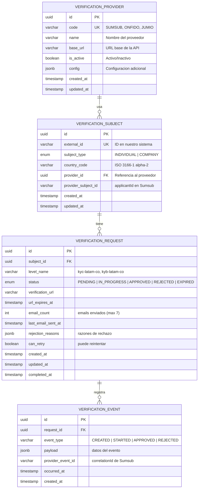
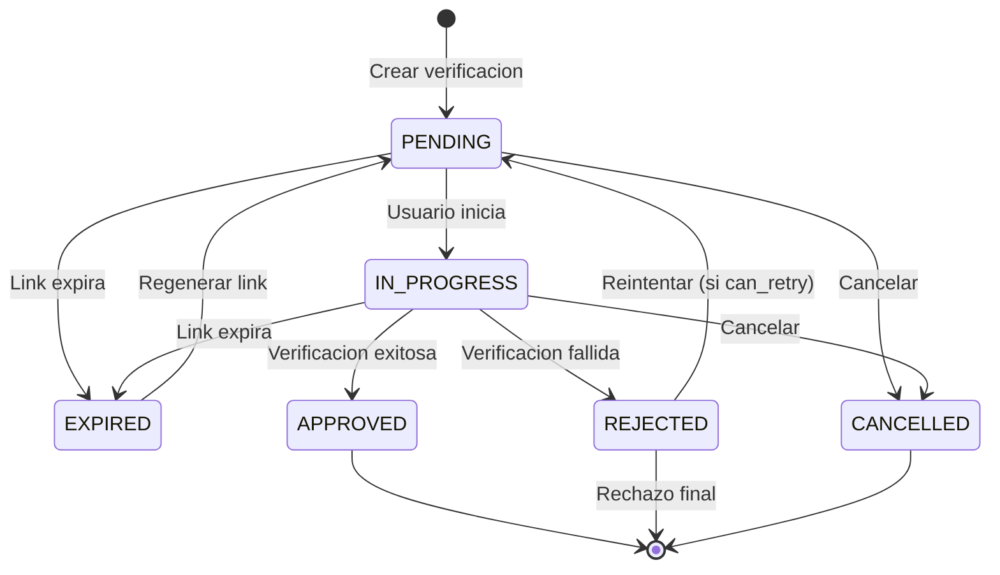
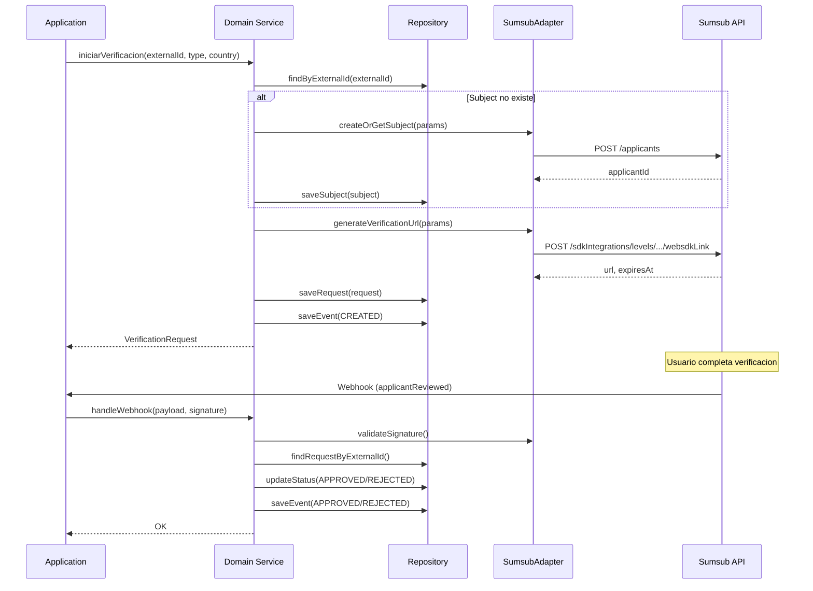
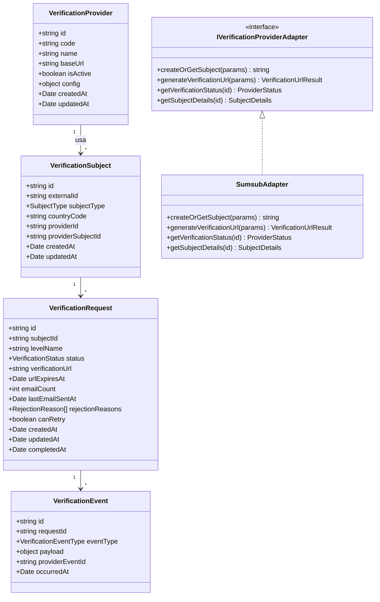

# Modelo de Dominio Unificado - Verificacion KYC/KYB

> **Version**: 2.0.0 | **Estado**: Draft

## 1. Resumen

Modelo relacional **provider-agnostic** para verificacion de identidad de **personas (KYC)** y **empresas (KYB)**. Diseñado para trabajar con Sumsub pero abstraido para soportar otros proveedores.

```
┌─────────────┐     ┌─────────────┐     ┌─────────────┐
│ Application │────>│   DOMAIN    │<────│   Adapter   │
│ (Use Cases) │     │  (Ports)    │     │  (Sumsub)   │
└─────────────┘     └─────────────┘     └─────────────┘
```

---

## 2. Principios de Diseño

| Principio | Descripcion |
|-----------|-------------|
| **Provider-agnostic** | Dominio no conoce "Applicant", "Inspection", etc. |
| **Datos minimos** | Solo referencias + estado. Sumsub = fuente de verdad |
| **Unificado** | Mismo modelo para KYC (personas) y KYB (empresas) |
| **Extensible** | Facil agregar nuevos proveedores o tipos de verificacion |

---

## 3. Modelo Relacional

### 3.1 Diagrama ER



### 3.2 Tabla: verification_providers

Catalogo de proveedores de verificacion soportados.

```sql
CREATE TABLE verification_providers (
    id UUID PRIMARY KEY DEFAULT gen_random_uuid(),

    -- Identificador unico del proveedor
    code VARCHAR(50) NOT NULL UNIQUE,

    -- Nombre descriptivo
    name VARCHAR(100) NOT NULL,

    -- URL base de la API (opcional, puede estar en config)
    base_url VARCHAR(255),

    -- Estado del proveedor
    is_active BOOLEAN NOT NULL DEFAULT true,

    -- Configuracion adicional (JSON)
    -- Ej: { "webhookSecret": "...", "apiVersion": "v3", "timeout": 30000 }
    config JSONB DEFAULT '{}',

    -- Timestamps
    created_at TIMESTAMP WITH TIME ZONE NOT NULL DEFAULT NOW(),
    updated_at TIMESTAMP WITH TIME ZONE NOT NULL DEFAULT NOW()
);

-- Indices
CREATE UNIQUE INDEX idx_providers_code ON verification_providers(code);

-- Datos iniciales
INSERT INTO verification_providers (code, name, base_url, is_active, config)
VALUES
    ('SUMSUB', 'Sumsub', 'https://api.sumsub.com', true, '{"apiVersion": "v3"}'),
    ('ONFIDO', 'Onfido', 'https://api.onfido.com', false, '{}'),
    ('JUMIO', 'Jumio', 'https://api.jumio.com', false, '{}');
```

### 3.3 Tabla: verification_subjects

Representa al sujeto de verificacion (persona o empresa).

```sql
CREATE TABLE verification_subjects (
    id UUID PRIMARY KEY DEFAULT gen_random_uuid(),

    -- Identificador en nuestro sistema
    external_id VARCHAR(255) NOT NULL UNIQUE,

    -- Tipo de sujeto
    subject_type VARCHAR(20) NOT NULL CHECK (subject_type IN ('INDIVIDUAL', 'COMPANY')),

    -- Pais (ISO 3166-1 alpha-2)
    country_code VARCHAR(2) NOT NULL,

    -- Proveedor de verificacion (FK)
    provider_id UUID NOT NULL REFERENCES verification_providers(id),

    -- ID del sujeto en el proveedor (applicantId en Sumsub)
    provider_subject_id VARCHAR(255),

    -- Timestamps
    created_at TIMESTAMP WITH TIME ZONE NOT NULL DEFAULT NOW(),
    updated_at TIMESTAMP WITH TIME ZONE NOT NULL DEFAULT NOW()
);

-- Indices
CREATE INDEX idx_subjects_external_id ON verification_subjects(external_id);
CREATE INDEX idx_subjects_provider_id ON verification_subjects(provider_id);
CREATE INDEX idx_subjects_provider_subject_id ON verification_subjects(provider_subject_id);
CREATE INDEX idx_subjects_type ON verification_subjects(subject_type);
```

### 3.4 Tabla: verification_requests

Representa una solicitud de verificacion. Un sujeto puede tener multiples solicitudes.

```sql
CREATE TABLE verification_requests (
    id UUID PRIMARY KEY DEFAULT gen_random_uuid(),

    -- Relacion con sujeto
    subject_id UUID NOT NULL REFERENCES verification_subjects(id),

    -- Nivel de verificacion (configurable en Sumsub)
    level_name VARCHAR(100) NOT NULL,

    -- Estado de la verificacion
    status VARCHAR(20) NOT NULL DEFAULT 'PENDING'
        CHECK (status IN ('PENDING', 'IN_PROGRESS', 'APPROVED', 'REJECTED', 'EXPIRED', 'CANCELLED')),

    -- URL de verificacion (permalink)
    verification_url TEXT,
    url_expires_at TIMESTAMP WITH TIME ZONE,

    -- Control de emails
    email_count INTEGER NOT NULL DEFAULT 0,
    last_email_sent_at TIMESTAMP WITH TIME ZONE,

    -- Resultado (cuando se completa)
    rejection_reasons JSONB, -- ["POOR_QUALITY", "DOCUMENT_EXPIRED"]
    can_retry BOOLEAN DEFAULT true,

    -- Timestamps
    created_at TIMESTAMP WITH TIME ZONE NOT NULL DEFAULT NOW(),
    updated_at TIMESTAMP WITH TIME ZONE NOT NULL DEFAULT NOW(),
    completed_at TIMESTAMP WITH TIME ZONE,

    -- Constraint: solo una verificacion activa por sujeto
    CONSTRAINT unique_active_verification
        EXCLUDE USING btree (subject_id WITH =)
        WHERE (status IN ('PENDING', 'IN_PROGRESS'))
);

-- Indices
CREATE INDEX idx_requests_subject_id ON verification_requests(subject_id);
CREATE INDEX idx_requests_status ON verification_requests(status);
CREATE INDEX idx_requests_level ON verification_requests(level_name);
CREATE INDEX idx_requests_url_expires ON verification_requests(url_expires_at)
    WHERE status IN ('PENDING', 'IN_PROGRESS');
```

### 3.5 Tabla: verification_events

Historial de eventos para auditoria y sincronizacion con webhooks.

```sql
CREATE TABLE verification_events (
    id UUID PRIMARY KEY DEFAULT gen_random_uuid(),

    -- Relacion con request
    request_id UUID NOT NULL REFERENCES verification_requests(id),

    -- Que paso
    event_type VARCHAR(50) NOT NULL,

    -- Datos adicionales del evento (flexible)
    payload JSONB,

    -- ID del evento en el proveedor (para idempotencia)
    provider_event_id VARCHAR(255),

    -- Timestamps
    occurred_at TIMESTAMP WITH TIME ZONE NOT NULL,
    created_at TIMESTAMP WITH TIME ZONE NOT NULL DEFAULT NOW(),

    -- Idempotencia: no procesar el mismo evento dos veces
    CONSTRAINT unique_provider_event UNIQUE (provider_event_id)
);

-- Indices
CREATE INDEX idx_events_request_id ON verification_events(request_id);
CREATE INDEX idx_events_type ON verification_events(event_type);
CREATE INDEX idx_events_occurred_at ON verification_events(occurred_at);
```

---

## 4. Enumeraciones y Tipos

### 4.1 Tipos de Sujeto

```typescript
enum SubjectType {
  INDIVIDUAL = 'INDIVIDUAL',  // Persona natural (KYC)
  COMPANY = 'COMPANY',        // Empresa (KYB)
}
```

### 4.2 Estados de Verificacion

```typescript
enum VerificationStatus {
  PENDING = 'PENDING',           // Creado, esperando que inicie
  IN_PROGRESS = 'IN_PROGRESS',   // Usuario completando verificacion
  APPROVED = 'APPROVED',         // Verificacion exitosa
  REJECTED = 'REJECTED',         // Verificacion rechazada
  EXPIRED = 'EXPIRED',           // Link expirado sin completar
  CANCELLED = 'CANCELLED',       // Cancelado manualmente
}
```

### 4.3 Tipos de Evento

```typescript
enum VerificationEventType {
  // Ciclo de vida
  CREATED = 'CREATED',
  STARTED = 'STARTED',
  DOCUMENTS_SUBMITTED = 'DOCUMENTS_SUBMITTED',
  IN_REVIEW = 'IN_REVIEW',

  // Resultados
  APPROVED = 'APPROVED',
  REJECTED = 'REJECTED',

  // Otros
  ON_HOLD = 'ON_HOLD',
  EXPIRED = 'EXPIRED',
  CANCELLED = 'CANCELLED',
  URL_REGENERATED = 'URL_REGENERATED',
  EMAIL_SENT = 'EMAIL_SENT',
}
```

### 4.4 Razones de Rechazo (Provider-Agnostic)

```typescript
enum RejectionReason {
  // Problemas de documento
  POOR_QUALITY = 'POOR_QUALITY',
  DOCUMENT_EXPIRED = 'DOCUMENT_EXPIRED',
  INVALID_DOCUMENT = 'INVALID_DOCUMENT',
  DOCUMENT_FORGERY = 'DOCUMENT_FORGERY',
  INCOMPLETE_DOCUMENT = 'INCOMPLETE_DOCUMENT',

  // Problemas de identidad
  DATA_MISMATCH = 'DATA_MISMATCH',
  SELFIE_MISMATCH = 'SELFIE_MISMATCH',
  LIVENESS_FAILED = 'LIVENESS_FAILED',

  // Compliance
  SANCTIONS_MATCH = 'SANCTIONS_MATCH',
  PEP_MATCH = 'PEP_MATCH',
  ADVERSE_MEDIA = 'ADVERSE_MEDIA',
  DUPLICATE_ACCOUNT = 'DUPLICATE_ACCOUNT',
  UNSUPPORTED_COUNTRY = 'UNSUPPORTED_COUNTRY',
  UNDERAGE = 'UNDERAGE',

  OTHER = 'OTHER',
}
```

### 4.5 Codigos de Proveedor

```typescript
// Codigos predefinidos (referencia a tabla verification_providers)
type ProviderCode = 'SUMSUB' | 'ONFIDO' | 'JUMIO';
```

---

## 5. Entidades de Dominio (TypeScript)

### 5.1 VerificationProvider

```typescript
interface VerificationProvider {
  id: string;                    // UUID
  code: string;                  // SUMSUB, ONFIDO, JUMIO
  name: string;                  // Nombre descriptivo
  baseUrl?: string;              // URL base de la API
  isActive: boolean;             // Activo/Inactivo
  config: Record<string, unknown>; // Configuracion adicional
  createdAt: Date;
  updatedAt: Date;
}
```

### 5.2 VerificationSubject

```typescript
interface VerificationSubject {
  id: string;                    // UUID
  externalId: string;            // ID en nuestro sistema
  subjectType: SubjectType;      // INDIVIDUAL | COMPANY
  countryCode: string;           // ISO 3166-1 alpha-2
  providerId: string;            // FK a VerificationProvider
  providerSubjectId?: string;    // applicantId en Sumsub
  createdAt: Date;
  updatedAt: Date;

  // Relacion (opcional, para joins)
  provider?: VerificationProvider;
}
```

### 5.3 VerificationRequest

```typescript
interface VerificationRequest {
  id: string;                    // UUID
  subjectId: string;             // FK a VerificationSubject
  levelName: string;             // kyc-latam-co, kyb-latam-co
  status: VerificationStatus;

  // URL de verificacion
  verificationUrl?: string;
  urlExpiresAt?: Date;

  // Control de emails
  emailCount: number;
  lastEmailSentAt?: Date;

  // Resultado
  rejectionReasons?: RejectionReason[];
  canRetry: boolean;

  // Timestamps
  createdAt: Date;
  updatedAt: Date;
  completedAt?: Date;
}
```

### 5.4 VerificationEvent

```typescript
interface VerificationEvent {
  id: string;                    // UUID
  requestId: string;             // FK a VerificationRequest
  eventType: VerificationEventType;
  payload?: Record<string, unknown>; // Datos adicionales del evento
  providerEventId?: string;      // correlationId de Sumsub
  occurredAt: Date;
  createdAt: Date;
}
```

---

## 6. Datos Sensibles - Decision Arquitectural

### NO duplicar datos personales en nuestra BD

```
┌─────────────────────────────────────────────────────────────────┐
│                                                                  │
│  NUESTRA BD (Retorna)               SUMSUB (Proveedor)          │
│  ├── externalId                     ├── Documentos              │
│  ├── providerSubjectId ────────────>├── Datos personales        │
│  ├── status                         ├── Fotos, IDs, selfies     │
│  ├── levelName                      ├── UBOs (para KYB)         │
│  └── timestamps                     └── Historial completo      │
│                                                                  │
│  Solo referencias + estado          Fuente de verdad            │
│                                                                  │
└─────────────────────────────────────────────────────────────────┘
```

### Justificacion

| Razon | Explicacion |
|-------|-------------|
| **Datos sensibles** | Documentos, fotos, datos de UBOs. Menos datos = menos riesgo |
| **GDPR/Compliance** | Sumsub maneja retencion y borrado de datos personales |
| **Sincronizacion** | Evitamos complejidad de mantener datos sincronizados |
| **Fuente de verdad** | Sumsub tiene el estado "real" de la verificacion |

### Consulta bajo demanda

Si necesitas datos del sujeto (ej: nombre, documentos), consulta a Sumsub:

```typescript
// En el adapter
async getSubjectDetails(providerSubjectId: string): Promise<SubjectDetails> {
  const response = await this.sumsubApi.get(`/applicants/${providerSubjectId}/one`);

  return {
    // Para INDIVIDUAL
    personalInfo: response.data.info,

    // Para COMPANY
    companyInfo: response.data.info?.companyInfo,
    beneficiaries: response.data.info?.companyInfo?.beneficiaries ?? [],
    directors: response.data.info?.companyInfo?.directors ?? [],
  };
}
```

---

## 7. Mapeo Sumsub -> Dominio

### 7.1 Entidades

| Sumsub | Dominio |
|--------|---------|
| `applicantId` | `providerSubjectId` |
| `externalUserId` | `externalId` |
| `type: individual` | `subjectType: INDIVIDUAL` |
| `type: company` | `subjectType: COMPANY` |
| `levelName` | `levelName` |
| Permalink URL | `verificationUrl` |

### 7.2 Estados

| Sumsub reviewStatus | Sumsub reviewAnswer | Dominio |
|---------------------|---------------------|---------|
| `init` | - | `PENDING` |
| `pending` | - | `IN_PROGRESS` |
| `prechecked` | - | `IN_PROGRESS` |
| `queued` | - | `IN_PROGRESS` |
| `onHold` | - | `IN_PROGRESS` |
| `completed` | `GREEN` | `APPROVED` |
| `completed` | `RED` | `REJECTED` |

### 7.3 Eventos (Webhooks)

| Sumsub Webhook | Dominio EventType |
|----------------|-------------------|
| `applicantCreated` | `CREATED` |
| `applicantPending` | `DOCUMENTS_SUBMITTED` |
| `applicantReviewed` (GREEN) | `APPROVED` |
| `applicantReviewed` (RED) | `REJECTED` |
| `applicantOnHold` | `ON_HOLD` |
| `applicantReset` | `CANCELLED` |

### 7.4 Razones de Rechazo

| Sumsub rejectLabel | Dominio RejectionReason |
|-------------------|------------------------|
| `UNSATISFACTORY_PHOTOS` | `POOR_QUALITY` |
| `DOCUMENT_EXPIRED` | `DOCUMENT_EXPIRED` |
| `NOT_DOCUMENT` | `INVALID_DOCUMENT` |
| `FORGERY` | `DOCUMENT_FORGERY` |
| `INCOMPLETE_DOCUMENT` | `INCOMPLETE_DOCUMENT` |
| `DB_DATA_MISMATCH` | `DATA_MISMATCH` |
| `SELFIE_MISMATCH` | `SELFIE_MISMATCH` |
| `FRAUDULENT_LIVENESS` | `LIVENESS_FAILED` |
| `SANCTIONS` | `SANCTIONS_MATCH` |
| `PEP` | `PEP_MATCH` |
| `ADVERSE_MEDIA` | `ADVERSE_MEDIA` |
| `DUPLICATE` | `DUPLICATE_ACCOUNT` |
| `WRONG_USER_REGION` | `UNSUPPORTED_COUNTRY` |
| `AGE_REQUIREMENT_MISMATCH` | `UNDERAGE` |

---

## 8. Contratos Internos (Ports)

### 8.1 IVerificationProviderAdapter

Interface que implementan los adaptadores de proveedores externos (Sumsub, Onfido, etc.).

```typescript
interface IVerificationProviderAdapter {
  /**
   * Crea o recupera un sujeto de verificacion
   */
  createOrGetSubject(params: CreateSubjectParams): Promise<string>;

  /**
   * Genera URL de verificacion
   */
  generateVerificationUrl(params: GenerateUrlParams): Promise<VerificationUrlResult>;

  /**
   * Obtiene estado actual desde el proveedor
   */
  getVerificationStatus(providerSubjectId: string): Promise<ProviderStatus>;

  /**
   * Obtiene detalles del sujeto (datos personales/empresa)
   */
  getSubjectDetails(providerSubjectId: string): Promise<SubjectDetails>;

  /**
   * Procesa un webhook del proveedor
   */
  processWebhook(payload: string, signature: string): Promise<VerificationEvent>;
}

interface CreateSubjectParams {
  externalId: string;
  subjectType: SubjectType;
  levelName: string;
  countryCode: string;
}

interface GenerateUrlParams {
  providerSubjectId: string;
  levelName: string;
  ttlSeconds?: number;
}

interface VerificationUrlResult {
  url: string;
  expiresAt: Date;
}

interface ProviderStatus {
  status: VerificationStatus;
  reviewAnswer?: 'GREEN' | 'RED';
  rejectionReasons?: RejectionReason[];
  canRetry?: boolean;
}

interface SubjectDetails {
  personalInfo?: {
    firstName?: string;
    lastName?: string;
    dateOfBirth?: string;
  };
  companyInfo?: {
    legalName?: string;
    registrationNumber?: string;
  };
  beneficiaries?: Array<{ fullName: string }>;
  directors?: Array<{ fullName: string }>;
}
```

### 8.2 IWebhookHandler

```typescript
interface IWebhookHandler {
  /**
   * Valida la firma del webhook
   */
  validateSignature(payload: string, signature: string): boolean;

  /**
   * Procesa el webhook y retorna un evento de dominio
   */
  processWebhook(payload: string, signature: string): Promise<VerificationEvent>;
}
```

---

## 9. Diagramas

### 9.1 Diagrama de Estados



### 9.2 Diagrama de Secuencia



### 9.3 Diagrama de Clases



---

## 10. Niveles de Verificacion (Configuracion)

Los niveles se configuran en Sumsub Dashboard. Ejemplos:

| Level Name | Tipo | Pais | Descripcion |
|------------|------|------|-------------|
| `kyc-latam-co` | INDIVIDUAL | CO | KYC para personas en Colombia |
| `kyc-latam-br` | INDIVIDUAL | BR | KYC para personas en Brasil |
| `kyc-latam-mx` | INDIVIDUAL | MX | KYC para personas en Mexico |
| `kyb-latam-co` | COMPANY | CO | KYB para empresas en Colombia |
| `kyb-latam-br` | COMPANY | BR | KYB para empresas en Brasil |

Cada level define:
- Documentos requeridos
- Pasos de verificacion (selfie, liveness, AML, etc.)
- Paises soportados

---

## 11. Ejemplos de Implementacion

### 11.1 Servicio de Dominio

```typescript
class VerificationService {
  constructor(
    private readonly providerRepo: IVerificationProviderRepository,
    private readonly subjectRepo: IVerificationSubjectRepository,
    private readonly requestRepo: IVerificationRequestRepository,
    private readonly eventRepo: IVerificationEventRepository,
    private readonly providerAdapter: IVerificationProviderAdapter,
  ) {}

  async initiateVerification(params: {
    externalId: string;
    subjectType: SubjectType;
    countryCode: string;
    levelName: string;
    providerCode?: string; // Default: 'SUMSUB'
  }): Promise<VerificationRequest> {
    // 1. Obtener proveedor
    const provider = await this.providerRepo.findByCode(params.providerCode ?? 'SUMSUB');
    if (!provider || !provider.isActive) {
      throw new ProviderNotAvailableError(params.providerCode ?? 'SUMSUB');
    }

    // 2. Buscar o crear sujeto
    let subject = await this.subjectRepo.findByExternalId(params.externalId);

    if (!subject) {
      const providerSubjectId = await this.providerAdapter.createOrGetSubject({
        externalId: params.externalId,
        subjectType: params.subjectType,
        levelName: params.levelName,
        countryCode: params.countryCode,
      });

      subject = await this.subjectRepo.save({
        externalId: params.externalId,
        subjectType: params.subjectType,
        countryCode: params.countryCode,
        providerId: provider.id,
        providerSubjectId,
      });
    }

    // 3. Verificar que no haya verificacion activa
    const activeRequest = await this.requestRepo.findActiveBySubjectId(subject.id);
    if (activeRequest) {
      throw new VerificationAlreadyInProgressError(subject.id, activeRequest.id);
    }

    // 4. Generar URL de verificacion
    const urlResult = await this.providerAdapter.generateVerificationUrl({
      providerSubjectId: subject.providerSubjectId!,
      levelName: params.levelName,
      ttlSeconds: 86400 * 30, // 30 dias
    });

    // 5. Crear request
    const request = await this.requestRepo.save({
      subjectId: subject.id,
      levelName: params.levelName,
      status: VerificationStatus.PENDING,
      verificationUrl: urlResult.url,
      urlExpiresAt: urlResult.expiresAt,
      emailCount: 0,
      canRetry: true,
    });

    // 6. Registrar evento (audit log)
    await this.eventRepo.save({
      requestId: request.id,
      eventType: VerificationEventType.CREATED,
      occurredAt: new Date(),
    });

    return request;
  }

  async handleWebhook(payload: string, signature: string): Promise<void> {
    // 1. Validar y parsear webhook
    const event = await this.providerAdapter.processWebhook(payload, signature);

    // 2. Verificar idempotencia
    const existingEvent = await this.eventRepo.findByProviderEventId(event.providerEventId);
    if (existingEvent) {
      return; // Ya procesado
    }

    // 3. Buscar request
    const subject = await this.subjectRepo.findByProviderSubjectId(event.subjectId);
    if (!subject) return;

    const request = await this.requestRepo.findActiveBySubjectId(subject.id);
    if (!request) return;

    // 4. Actualizar estado segun el tipo de evento
    const newStatus = this.mapEventToStatus(event.eventType);
    if (newStatus) {
      request.status = newStatus;

      if (newStatus === VerificationStatus.APPROVED ||
          newStatus === VerificationStatus.REJECTED) {
        request.completedAt = new Date();
      }
    }

    if (event.payload?.rejectionReasons) {
      request.rejectionReasons = event.payload.rejectionReasons;
      request.canRetry = event.payload.canRetry ?? true;
    }

    await this.requestRepo.save(request);

    // 5. Registrar evento (audit log)
    await this.eventRepo.save({
      requestId: request.id,
      eventType: event.eventType,
      payload: event.payload,
      providerEventId: event.providerEventId,
      occurredAt: event.occurredAt,
    });
  }

  private mapEventToStatus(eventType: VerificationEventType): VerificationStatus | null {
    const map: Record<string, VerificationStatus> = {
      [VerificationEventType.STARTED]: VerificationStatus.IN_PROGRESS,
      [VerificationEventType.APPROVED]: VerificationStatus.APPROVED,
      [VerificationEventType.REJECTED]: VerificationStatus.REJECTED,
      [VerificationEventType.EXPIRED]: VerificationStatus.EXPIRED,
      [VerificationEventType.CANCELLED]: VerificationStatus.CANCELLED,
    };
    return map[eventType] ?? null;
  }
}
```

### 11.2 Adapter de Sumsub

```typescript
class SumsubAdapter implements IVerificationProviderAdapter {
  constructor(
    private readonly apiClient: SumsubApiClient,
    private readonly mapper: SumsubMapper,
  ) {}

  async createOrGetSubject(params: CreateSubjectParams): Promise<string> {
    // Intentar obtener existente
    try {
      const existing = await this.apiClient.getApplicantByExternalId(params.externalId);
      return existing.id;
    } catch (e) {
      if (e.status !== 404) throw e;
    }

    // Crear nuevo
    const response = await this.apiClient.createApplicant({
      externalUserId: params.externalId,
      type: params.subjectType === SubjectType.COMPANY ? 'company' : 'individual',
      levelName: params.levelName,
    });

    return response.id;
  }

  async generateVerificationUrl(params: GenerateUrlParams): Promise<VerificationUrlResult> {
    const response = await this.apiClient.generateWebSdkLink({
      levelName: params.levelName,
      externalUserId: params.providerSubjectId,
      ttlInSecs: params.ttlSeconds ?? 86400,
    });

    return {
      url: response.url,
      expiresAt: new Date(Date.now() + (params.ttlSeconds ?? 86400) * 1000),
    };
  }

  async getVerificationStatus(providerSubjectId: string): Promise<ProviderStatus> {
    const response = await this.apiClient.getApplicantStatus(providerSubjectId);
    return this.mapper.toProviderStatus(response);
  }

  async getSubjectDetails(providerSubjectId: string): Promise<SubjectDetails> {
    const response = await this.apiClient.getApplicant(providerSubjectId);
    return this.mapper.toSubjectDetails(response);
  }
}
```

### 11.3 Webhook Handler

```typescript
class SumsubWebhookHandler implements IWebhookHandler {
  constructor(
    private readonly secretKey: string,
    private readonly mapper: SumsubMapper,
  ) {}

  validateSignature(payload: string, signature: string): boolean {
    const expected = crypto
      .createHmac('sha256', this.secretKey)
      .update(payload)
      .digest('hex');
    return signature === expected;
  }

  async processWebhook(payload: string, signature: string): Promise<VerificationEvent> {
    if (!this.validateSignature(payload, signature)) {
      throw new InvalidWebhookSignatureError();
    }

    const data = JSON.parse(payload);
    return this.mapper.toVerificationEvent(data);
  }
}
```

---

## 12. Queries Utiles

### Verificaciones pendientes con link por expirar

```sql
SELECT r.*, s.external_id, p.code as provider_code
FROM verification_requests r
JOIN verification_subjects s ON r.subject_id = s.id
JOIN verification_providers p ON s.provider_id = p.id
WHERE r.status IN ('PENDING', 'IN_PROGRESS')
  AND r.url_expires_at < NOW() + INTERVAL '7 days'
  AND r.url_expires_at > NOW()
ORDER BY r.url_expires_at;
```

### Verificaciones por estado, tipo y proveedor

```sql
SELECT
  p.code as provider,
  s.subject_type,
  r.status,
  COUNT(*) as count
FROM verification_requests r
JOIN verification_subjects s ON r.subject_id = s.id
JOIN verification_providers p ON s.provider_id = p.id
WHERE r.created_at > NOW() - INTERVAL '30 days'
GROUP BY p.code, s.subject_type, r.status
ORDER BY p.code, s.subject_type, r.status;
```

### Historial de eventos de una verificacion

```sql
SELECT
  e.event_type,
  e.occurred_at,
  e.payload
FROM verification_events e
JOIN verification_requests r ON e.request_id = r.id
JOIN verification_subjects s ON r.subject_id = s.id
WHERE s.external_id = 'emp-co-001'
ORDER BY e.occurred_at;
```

### Proveedores activos con conteo de sujetos

```sql
SELECT
  p.code,
  p.name,
  p.is_active,
  COUNT(s.id) as subjects_count
FROM verification_providers p
LEFT JOIN verification_subjects s ON p.id = s.provider_id
GROUP BY p.id, p.code, p.name, p.is_active
ORDER BY p.code;
```

---

## 13. Referencias

- [Sumsub API Docs](https://docs.sumsub.com/reference/about-sumsub-api)
- [Sumsub Webhooks](https://docs.sumsub.com/docs/user-verification-webhooks)
- [Sumsub Reject Labels](https://docs.sumsub.com/reference/rejected)
