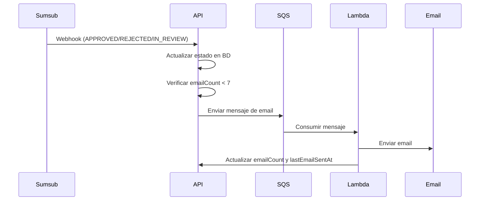
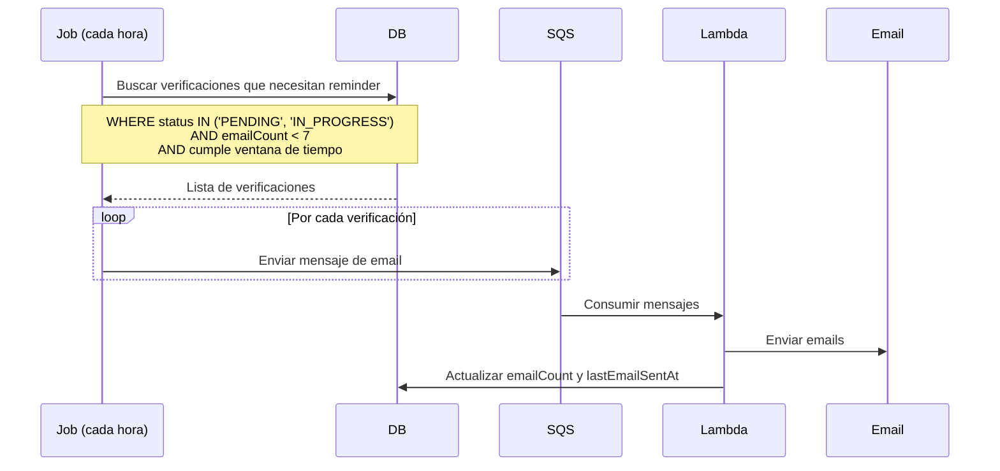

# Automatizacion de Emails - KYB

> **Version**: 1.0.0 | **Estado**: Draft

## 1. Arquitectura

```
┌─────────────────────────────────────────────────────────────────┐
│                                                                  │
│  INMEDIATOS (Webhook → SQS)                                     │
│  ┌─────────┐     ┌─────────┐     ┌─────────┐                   │
│  │ Webhook │────>│   SQS   │────>│ Lambda  │───> Email         │
│  └─────────┘     └─────────┘     └─────────┘                   │
│                                                                  │
│  CON VENTANA (Job → SQS)                                        │
│  ┌─────────┐     ┌─────────┐     ┌─────────┐                   │
│  │  Job    │────>│   SQS   │────>│ Lambda  │───> Email         │
│  │(revisa BD)    └─────────┘     └─────────┘                   │
│  └─────────┘                                                    │
│                                                                  │
└─────────────────────────────────────────────────────────────────┘
```

---

## 2. Tipos de Email

### Inmediatos (desde webhook)

| Evento | Email | Trigger |
|--------|-------|---------|
| `IN_REVIEW` | "En revisión" | Webhook → SQS |
| `APPROVED` | "Verificación aprobada + siguientes pasos" | Webhook → SQS |
| `REJECTED` | "Verificación rechazada + siguientes pasos" | Webhook → SQS |

### Con ventana (desde job)

| Estado | Días sin avance | Email |
|--------|-----------------|-------|
| `PENDING` | 3 días | "No olvides iniciar tu verificación" |
| `PENDING` | 7 días | "Tu verificación sigue pendiente" |
| `PENDING` | 14 días | "Último recordatorio - link expira pronto" |
| `IN_PROGRESS` | 3 días | "Faltan pasos para completar" |
| `IN_PROGRESS` | 7 días | "Tu verificación está incompleta" |
| `IN_PROGRESS` | 14 días | "Último recordatorio - completa tu verificación" |

---

## 3. Limites

| Limite | Valor |
|--------|-------|
| Máximo emails por verificación | 7 |
| Mínimo entre emails | 24 horas |

---

## 4. Flujo Inmediato (Webhook)



### Mensaje SQS (inmediato)

```typescript
interface EmailMessage {
  type: 'IMMEDIATE';
  verificationId: string;
  externalId: string;
  trigger: 'IN_REVIEW' | 'APPROVED' | 'REJECTED';
  recipientEmail: string;
  data: {
    companyName?: string;
    // datos adicionales para el template
  };
}
```

---

## 5. Flujo con Ventana (Job)



### Query del Job

```sql
SELECT * FROM business_verifications
WHERE status IN ('PENDING', 'IN_PROGRESS')
  AND email_count < 7
  AND url_expires_at > NOW()  -- link aún válido
  AND (
    -- Primer reminder: 3 días sin avance
    (email_count = 0 AND updated_at < NOW() - INTERVAL '3 days')
    OR
    -- Segundo reminder: 7 días sin avance
    (email_count = 1 AND updated_at < NOW() - INTERVAL '7 days')
    OR
    -- Tercer reminder: 14 días sin avance
    (email_count = 2 AND updated_at < NOW() - INTERVAL '14 days')
  )
  AND (last_email_sent_at IS NULL OR last_email_sent_at < NOW() - INTERVAL '24 hours');
```

### Mensaje SQS (reminder)

```typescript
interface EmailMessage {
  type: 'REMINDER';
  verificationId: string;
  externalId: string;
  trigger: 'PENDING_3D' | 'PENDING_7D' | 'PENDING_14D' | 'IN_PROGRESS_3D' | 'IN_PROGRESS_7D' | 'IN_PROGRESS_14D';
  recipientEmail: string;
  data: {
    companyName?: string;
    verificationUrl: string;
    daysRemaining: number;
  };
}
```

---

## 6. Lambda de Envío

```typescript
async function handler(event: SQSEvent): Promise<void> {
  for (const record of event.Records) {
    const message: EmailMessage = JSON.parse(record.body);

    // 1. Verificar que aún debe enviarse
    const verification = await getVerification(message.verificationId);
    if (verification.emailCount >= 7) {
      continue; // Ya llegó al máximo
    }

    // 2. Seleccionar template
    const template = getTemplate(message.trigger);

    // 3. Enviar email
    await emailService.send({
      to: message.recipientEmail,
      template,
      data: message.data,
    });

    // 4. Actualizar contadores
    await updateVerification(message.verificationId, {
      emailCount: verification.emailCount + 1,
      lastEmailSentAt: new Date(),
    });
  }
}
```

---

## 7. Templates de Email

| Trigger | Subject | Contenido clave |
|---------|---------|-----------------|
| `PENDING_3D` | "Inicia tu verificación KYB" | Link + instrucciones |
| `PENDING_7D` | "Tu verificación sigue pendiente" | Link + urgencia media |
| `PENDING_14D` | "Último recordatorio" | Link + urgencia alta |
| `IN_PROGRESS_3D` | "Completa tu verificación" | Link + pasos faltantes |
| `IN_PROGRESS_7D` | "Tu verificación está incompleta" | Link + urgencia media |
| `IN_PROGRESS_14D` | "Último recordatorio" | Link + urgencia alta |
| `IN_REVIEW` | "Verificación en revisión" | Info de tiempos |
| `APPROVED` | "Verificación aprobada" | Siguientes pasos |
| `REJECTED` | "Verificación rechazada" | Motivo + opciones |

---

## 8. Configuracion del Job

```typescript
// Ejecutar cada hora
const JOB_CONFIG = {
  schedule: 'rate(1 hour)',  // CloudWatch Events / EventBridge

  // Ventanas de tiempo para reminders
  windows: {
    PENDING: [3, 7, 14],      // días
    IN_PROGRESS: [3, 7, 14],  // días
  },

  // Límites
  maxEmailsPerVerification: 7,
  minHoursBetweenEmails: 24,
};
```

---

## 9. Resumen

| Aspecto | Valor |
|---------|-------|
| Emails inmediatos | IN_REVIEW, APPROVED, REJECTED |
| Emails con ventana | 3, 7, 14 días sin avance |
| Estados que reciben reminder | PENDING, IN_PROGRESS |
| Máximo emails | 7 por verificación |
| Mínimo entre emails | 24 horas |
| Job de reminders | Cada hora |
| Cola | SQS |
| Procesador | Lambda |
