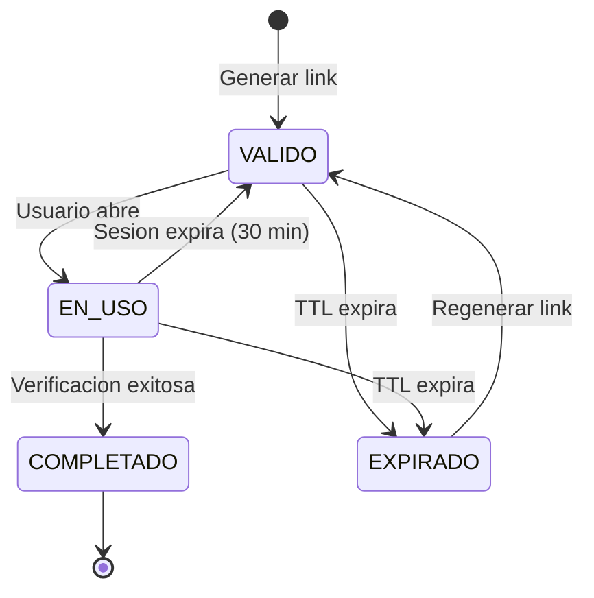

# Comportamiento del Link: Reanudacion y Expiracion

> **Version**: 1.0.0 | **Estado**: Draft

## 1. Resumen

| Concepto | Valor | Fuente |
|----------|-------|--------|
| TTL del link | **30 dias** (maximo, recomendado) | [Docs](https://docs.sumsub.com/docs/verification-links) |
| Sesion activa | 30 minutos de inactividad | [Docs](https://docs.sumsub.com/docs/verification-links) |
| Progreso | Se guarda por step completado | Validado en sandbox |
| Si link expira | Se pierde todo el progreso | Validado en sandbox |

---

## 2. Dos Tiempos Diferentes

```
┌─────────────────────────────────────────────────────────────────┐
│                 TTL DEL LINK (hasta 30 dias)                     │
│                                                                  │
│   ┌────────┐    ┌────────┐    ┌────────┐    ┌────────┐         │
│   │Sesion 1│    │Sesion 2│    │Sesion 3│    │Sesion N│   ...   │
│   │ 30 min │    │ 30 min │    │ 30 min │    │ 30 min │         │
│   └───┬────┘    └───┬────┘    └───┬────┘    └───┬────┘         │
│       │             │             │             │                │
│       ▼             ▼             ▼             ▼                │
│   Progreso      Progreso      Progreso      Completa            │
│   guardado      guardado      guardado      verificacion        │
│                                                                  │
└─────────────────────────────────────────────────────────────────┘
```

| Tiempo | Descripcion | Duracion | Configurable |
|--------|-------------|----------|:------------:|
| **TTL del link** | Cuanto tiempo el link es accesible | Hasta 30 dias | Si (ttlInSecs) |
| **Sesion activa** | Inactividad antes de pedir re-autenticacion | 30 minutos | No (fijo) |

> **Importante**: Son independientes. Con TTL de 30 dias, el usuario puede acceder al link durante 1 mes, pero si esta inactivo 30 min debe re-autenticarse (no pierde progreso de steps completados).

---

## 3. Que se Conserva vs Que se Pierde

### Mientras el link es valido

| Dato | Persiste entre sesiones | Nota |
|------|:-----------------------:|------|
| Steps completados | ✅ Si | Se guarda al completar cada step |
| Documentos de steps completados | ✅ Si | Guardado en Sumsub |
| Formularios no enviados | ❌ No | Solo en browser |

### Cuando el link expira

| Dato | Se conserva |
|------|:-----------:|
| Steps completados | ❌ No |
| Documentos subidos | ❌ No |
| Todo el progreso | ❌ No |

> ✅ **Validado en sandbox**: El progreso se guarda por step mientras el link es válido. Si el link expira, se pierde todo.

---

## 4. Escenarios de Reanudacion

| Escenario | Resultado |
|-----------|-----------|
| Usuario abandona, vuelve con link valido (mismo dispositivo) | ✅ Retoma donde dejo |
| Usuario abandona, vuelve con link valido (otro dispositivo) | ⚠️ Retoma solo lo enviado a Sumsub |
| Sesion expira (30 min inactivo), link valido | ⚠️ Repite verificacion de email |
| Link expira | ❌ No puede acceder, necesita nuevo link |
| Usuario completa, usa link otra vez | ℹ️ Ve mensaje "ya completado" |

---

## 5. Cuando el Link Expira

```
┌─────────────────────────────────────────────────────────────────┐
│  LINK EXPIRA = SE PIERDE TODO EL PROGRESO                       │
│                                                                  │
│  - Documentos subidos: PERDIDOS                                 │
│  - Steps completados: PERDIDOS                                  │
│  - Debe empezar de cero                                         │
└─────────────────────────────────────────────────────────────────┘
```

Por esto es importante usar el **TTL maximo (30 dias)** para minimizar este riesgo.

### Regenerar link para mismo externalUserId

```typescript
// Al llamar con el mismo externalUserId:
POST /resources/sdkIntegrations/levels/-/websdkLink
{
  "levelName": "kyb-latam-colombia",
  "userId": "emp-co-001",  // mismo externalUserId
  "ttlInSecs": 2592000     // 30 dias (maximo)
}

// Resultado:
// - Nuevo link generado
// - Usuario debe empezar verificacion desde cero
```

---

## 6. Configuracion Recomendada

| Parametro | Valor | Justificacion |
|-----------|-------|---------------|
| `ttlInSecs` | 2592000 (30 dias) | Maximo permitido, evita perdida de progreso |

### Ejemplo API

```typescript
const response = await sumsubApi.post('/resources/sdkIntegrations/levels/-/websdkLink', {
  levelName: 'kyb-latam-colombia',
  userId: externalId,           // nuestro ID de empresa
  ttlInSecs: 2592000,           // 30 dias (maximo)
  lang: 'es'
});

// Response: { url: "https://in.sumsub.com/websdk/p/abc123" }
```

---

## 7. Proteccion Anti-Sesiones Simultaneas

Sumsub bloquea multiples sesiones activas para el mismo applicant:

```
┌─────────────────────────────────────────────────────────────────┐
│  Si el link ya tiene una sesion activa en otro                  │
│  navegador/dispositivo, Sumsub BLOQUEA la nueva sesion          │
└─────────────────────────────────────────────────────────────────┘
```

Esto previene que multiples personas verifiquen simultaneamente con el mismo link.

---

## 8. Diagrama de Estados del Link



---

## 9. Resumen de Decisiones

| Aspecto | Decision | Razon |
|---------|----------|-------|
| TTL | 30 dias (maximo) | Evitar perdida de progreso |
| Si link expira | Nuevo link, empezar de cero | No hay forma de recuperar progreso |
| Progreso | Se guarda por step completado | Mientras link sea valido |

---

## 10. Errores Esperados y Mapeo

### Errores de API (al generar link)

| HTTP | Codigo | Nombre | Descripcion | Accion Retorna |
|:----:|--------|--------|-------------|----------------|
| 401 | 4000 | `app-token-invalid-format` | Token de app mal formado | Revisar configuracion |
| 401 | 4002 | `app-token-private-part-mismatch` | App token invalido | Revisar credentials |
| 401 | 4003 | `app-token-signature-mismatch` | Firma de request incorrecta | Revisar firma HMAC |
| 400 | - | `bad-request` | Datos invalidos | Revisar payload |
| 404 | - | `level-not-found` | Nivel no existe | Verificar levelName en Sumsub |

### Errores de Verificacion (durante el proceso)

| Codigo | Nombre | Descripcion | Accion Retorna |
|:------:|--------|-------------|----------------|
| 9100 | `invalid-data` | Datos invalidos proporcionados | Usuario debe corregir |
| 9101 | `method-not-allowed` | No puede verificarse con este metodo | Contactar soporte |
| 9105 | `max-attempts` | Maximo de intentos excedido | Bloquear, contactar soporte |

### Errores de Link/Token (al acceder)

| Escenario | Error | Accion Retorna |
|-----------|-------|----------------|
| Link expirado | `token-invalid` / 401 | Marcar EXPIRED, ofrecer regenerar |
| Link ya usado (completado) | Pantalla "completado" | Mostrar estado actual |
| Link malformado | `invalid-token` / 400 | Error, verificar URL |

### Mapeo de Errores en Codigo

```typescript
const ERROR_HANDLERS: Record<string, ErrorAction> = {
  'token-invalid': {
    status: 'EXPIRED',
    userMessage: 'Tu enlace ha expirado. Solicita uno nuevo.',
    action: 'REGENERATE_LINK',
  },
  'max-attempts': {
    status: 'REJECTED',
    userMessage: 'Has excedido el número máximo de intentos.',
    action: 'CONTACT_SUPPORT',
  },
  'invalid-data': {
    status: 'IN_PROGRESS',
    userMessage: 'Por favor verifica la información ingresada.',
    action: 'RETRY_STEP',
  },
};

function handleSumsubError(errorCode: string): ErrorAction {
  return ERROR_HANDLERS[errorCode] ?? {
    status: 'IN_PROGRESS',
    userMessage: 'Ocurrió un error. Intenta de nuevo.',
    action: 'RETRY',
  };
}
```

### Referencia

- [Error codes](https://docs.sumsub.com/reference/error-codes)

---

## 11. Referencias

### Documentacion Sumsub

| Tema | URL |
|------|-----|
| Verification links | https://docs.sumsub.com/docs/verification-links |
| Generate WebSDK permalink | https://docs.sumsub.com/docs/generate-websdk-permalink |
| Generate external link (API) | https://docs.sumsub.com/reference/generate-websdk-external-link |

### Validado en sandbox

- [x] Progreso se guarda al completar cada step
- [x] Si link expira, se pierde todo el progreso
- [x] Sesion activa es 30 min (independiente del TTL del link)
