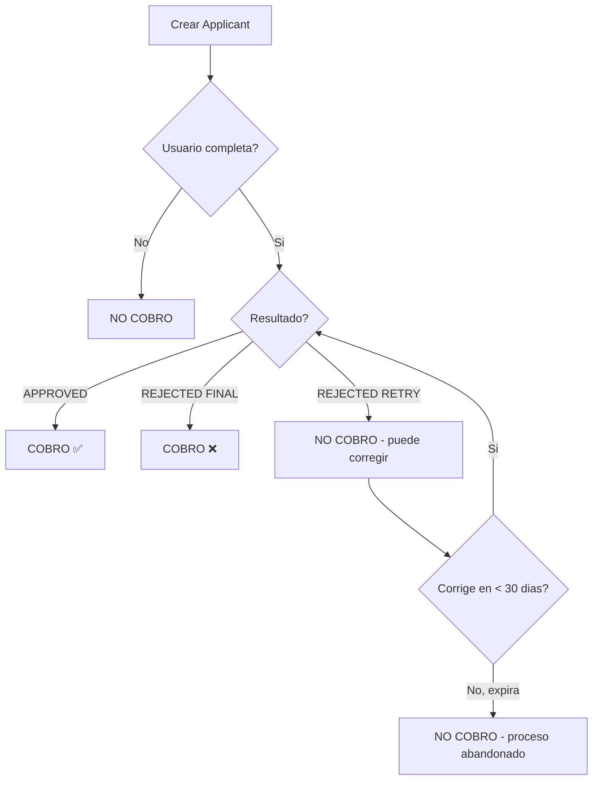
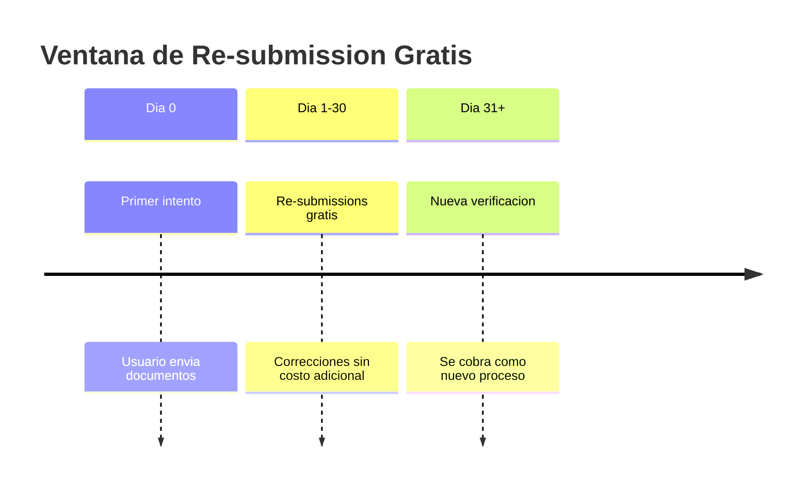
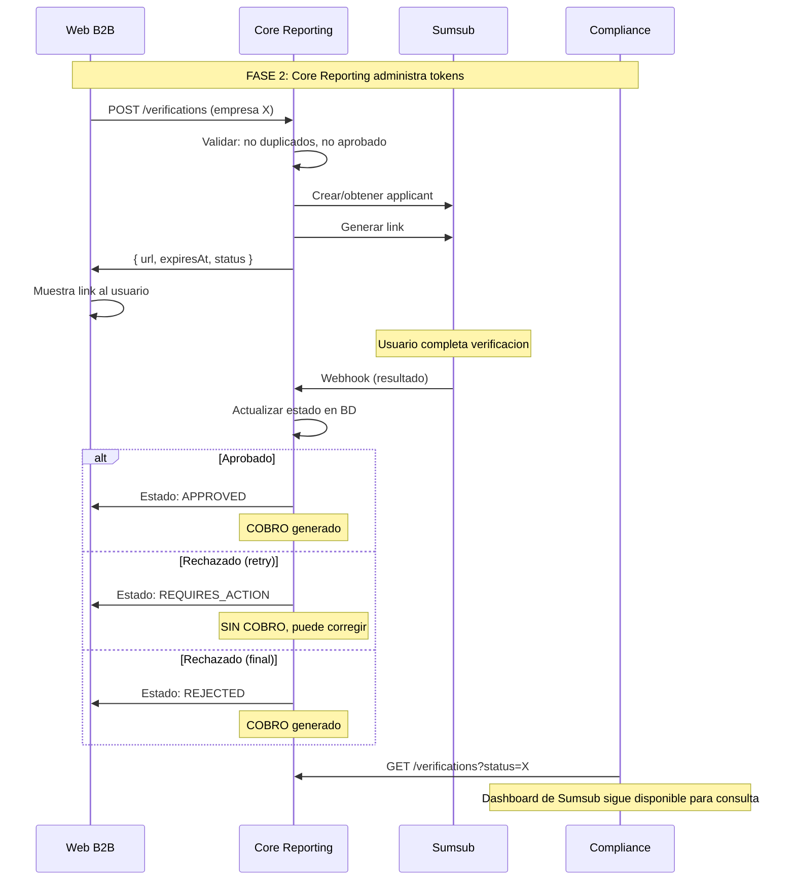

# Modelo de Precios Sumsub y Decisiones Tecnicas

> **Version**: 1.0.0 | **Estado**: Draft | **HU**: COR-140 Fase 2

## Referencias Principales

- **HU**: https://retorna-team.atlassian.net/browse/COR-140
- **Sumsub KYB**: https://docs.sumsub.com/docs/how-business-verification-works
- **Soporte Sumsub**: Comunicacion directa (ver seccion 2.1)

---

## 1. Resumen Ejecutivo

Este documento define las decisiones tecnicas para optimizar costos de Sumsub KYB, basado en el modelo de precios del plan Enterprise.

> **Contexto HU COR-140 Fase 2**: "La web B2B pasa a disponibilizar el link de KYB y Core Reporting comienza a administrar los tokens."

```
┌─────────────────────────────────────────────────────────────────┐
│  REGLA DE ORO: Solo se cobra cuando hay RESULTADO FINAL         │
│                                                                  │
│  ✅ APPROVED  → Cobro                                            │
│  ❌ REJECTED (FINAL) → Cobro                                     │
│  🔄 REJECTED (RETRY) → NO cobra (puede corregir)                │
│  ⏳ PENDING/IN_PROGRESS → NO cobra                               │
│  💀 EXPIRED → NO cobra (pero se pierde progreso)                │
└─────────────────────────────────────────────────────────────────┘
```

---

## 2. Modelo de Precios Sumsub (Enterprise)

### 2.1 Estructura de Costos

> **Fuente**: Comunicacion directa con Soporte Sumsub

| Concepto | Valor | Nota |
|----------|-------|------|
| **Compromiso minimo** | €12,000/año o €1,000/mes | Plan Enterprise obligatorio para KYB |
| **Verificacion KYB** | Variable (Auto vs Full) | Consultar precios especificos |
| **AML Monitoring** | $0.08/check | Inicial + cada match posterior |
| **Re-submissions** | GRATIS | Dentro de 1 mes del primer intento |

**Extracto de Soporte Sumsub:**

> *"A completed check means the applicant has proceeded with verification - submitted their data and initiated the check. We charge only when an applicant's verification is either approved or rejected (with a final rejection). Resubmissions within one month of the applicant's first attempt are included in the price."*

### 2.2 Tipos de KYB

> **Fuente**: [How Business Verification Works](https://docs.sumsub.com/docs/how-business-verification-works) + Comunicacion con Soporte Sumsub

Sumsub ofrece dos tipos de verificacion empresarial:

| Tipo | Que incluye | Uso recomendado |
|------|-------------|-----------------|
| **Auto KYB** | Verificacion automatizada: AML screening + consulta a registros corporativos. Sin revision humana. | Procesos rapidos, menor costo, verificacion inicial |
| **Full KYB** | Todo lo de Auto KYB + revision manual por expertos + verificacion completa de estructura de propiedad y UBOs con KYC | Mayor rigor regulatorio, estructuras complejas |

### 2.2.1 Detalle Auto KYB

Segun documentacion Sumsub:

- **Corporate AML Screening**: Revision contra listas de sanciones y bases de datos
- **Automated Corporate Registry Check**: Extraccion de datos de registros globales y locales
- **Opcional**: Lectura automatizada de documentos empresariales (ACDR)

> Ref: https://docs.sumsub.com/docs/how-business-verification-works

### 2.2.2 Detalle Full KYB

Incluye todo lo de Auto KYB mas:

- **Revision manual de documentos**: Analisis por expertos legales
- **Verificacion de estructura de propiedad**: Determinar estructura completa, porcentajes y verificar beneficiarios con KYC

> Ref: https://docs.sumsub.com/docs/how-business-verification-works

> **Pendiente**: Confirmar con Sumsub cual tipo aplica para cada pais (CO, BR, MX) y obtener precios exactos.

### 2.3 Cuando se Genera Cobro



**Puntos clave:**
1. **Crear applicant NO genera cobro** - Solo reserva el slot
2. **Generar link NO genera cobro** - Solo da acceso al usuario
3. **Usuario abandona NO genera cobro** - Aunque haya subido documentos
4. **Re-submission gratis** - Si corrige dentro de 30 dias del primer intento

---

## 3. Decisiones Tecnicas para Optimizar Costos

### 3.1 Momento de Creacion del Applicant

| Estrategia | Pros | Contras | Decision |
|------------|------|---------|:--------:|
| Al registrar empresa | Preparado de antemano | Applicants sin usar | ❌ |
| Al solicitar link | Balance entre preparacion y uso | Ninguno relevante | ✅ |
| Al iniciar verificacion | Minimo overhead | Latencia al usuario | ❌ |

**Decision**: Crear applicant **cuando la empresa solicita el link** por primera vez.

```typescript
// CORRECTO: Crear applicant al solicitar link
async function getOrCreateVerificationLink(externalId: string): Promise<string> {
  let subject = await repo.findByExternalId(externalId);

  if (!subject) {
    // Crear applicant en Sumsub (NO genera cobro)
    const applicantId = await sumsub.createApplicant(externalId);
    subject = await repo.save({ externalId, applicantId });
  }

  // Generar link (NO genera cobro)
  return sumsub.generateLink(subject.applicantId);
}
```

> Ref Crear Applicant: https://docs.sumsub.com/reference/create-an-applicant
> Ref Generar Link: https://docs.sumsub.com/reference/generate-websdk-external-link

### 3.2 Reutilizacion de Applicant

```
┌─────────────────────────────────────────────────────────────────┐
│  1 APPLICANT = 1 EMPRESA (externalId)                           │
│                                                                  │
│  Reutilizar el mismo applicant para:                            │
│  - Regenerar links expirados                                    │
│  - Re-intentos despues de rechazo                               │
│  - Cambio de pais (si aplica)                                   │
└─────────────────────────────────────────────────────────────────┘
```

**Beneficio**: Sumsub mantiene el historial y las re-submissions son gratis dentro de 30 dias.

### 3.3 Manejo de Links Expirados

| Escenario | Accion | Costo |
|-----------|--------|:-----:|
| Link expira sin iniciar | Regenerar link (mismo applicant) | $0 |
| Link expira con progreso parcial | Regenerar link, usuario reinicia | $0 |
| Link expira despues de submit | Regenerar link, continua revision | $0 |

**Nota**: El progreso se pierde si el link expira, pero **no hay cobro adicional** por regenerar. Ver LINK-BEHAVIOR.md para detalles de TTL y reanudacion.

> Ref: https://docs.sumsub.com/docs/verification-links

### 3.4 Ventana de Re-submission (30 dias)



**Implicacion tecnica**:
- Guardar `first_submission_at` en la BD
- Mostrar al usuario dias restantes para corregir
- Si pasan 30 dias, evaluar si iniciar nuevo proceso

### 3.5 Prevencion de Verificaciones Duplicadas

> **Fuente**: ANTI-DUPLICACION.md + Regla de negocio HU COR-140: "Cada empresa debe tener un único proceso activo asociado"

| Regla | Implementacion |
|-------|----------------|
| 1 verificacion activa por empresa | Constraint BD + validacion API |
| Empresa aprobada no repite | Estado APPROVED es final |
| Empresa rechazada puede reintentar | Solo si `can_retry = true` |

```sql
-- Constraint: solo 1 verificacion activa por empresa
CREATE UNIQUE INDEX idx_one_active_per_company
ON verification_requests (subject_id)
WHERE status IN ('PENDING', 'IN_PROGRESS');
```

Ver ANTI-DUPLICACION.md para logica completa de idempotencia.

---

## 4. Administracion de Tokens por Core Reporting

> **Fuente**: HU COR-140 Fase 2 - "La web B2B pasa a disponibilizar el link de KYB y Core Reporting comienza a administrar los tokens"

### 4.1 Que Significa "Administrar Tokens"

En el contexto de la Fase 2 (segun HU COR-140), "administrar tokens" se refiere a:

```
┌─────────────────────────────────────────────────────────────────┐
│  CORE REPORTING es el UNICO punto de control para:              │
│                                                                  │
│  1. Crear applicants en Sumsub                                  │
│  2. Generar links de verificacion                               │
│  3. Controlar estados y transiciones                            │
│  4. Procesar webhooks (resultados)                              │
│  5. Decidir cuando permitir re-intentos                         │
│                                                                  │
│  → Ni la web B2B ni el portal de Sumsub inician procesos        │
│  → Todo pasa por Core Reporting                                 │
└─────────────────────────────────────────────────────────────────┘
```

### 4.2 Flujo de Fase 2



> Ref Webhooks: https://docs.sumsub.com/docs/webhooks
> Ref Generate Link: https://docs.sumsub.com/reference/generate-websdk-external-link

### 4.3 Responsabilidades por Fase

> **Fuente**: HU COR-140 - Fases definidas en Notion

| Componente | Responsabilidad | Fase 1 | Fase 2 |
|------------|-----------------|:------:|:------:|
| **Portal Sumsub** | Crear links manualmente | ✅ | ✅ (backup) |
| **Web B2B** | Solicitar link al usuario | ❌ | ✅ |
| **Core Reporting** | Orquestar todo el proceso | ❌ | ✅ |
| **Compliance** | Revisar resultados | Manual | Dashboard + API |

### 4.4 Estados de Negocio (HU COR-140)

> **Fuente**: HU COR-140 - "Estados de Negocio Esperados"

| Estado Portal | Estado Interno | Accion Usuario |
|---------------|----------------|----------------|
| No iniciado | Sin registro | Iniciar verificacion |
| En progreso | `PENDING` / `IN_PROGRESS` | Continuar verificacion |
| Enviado / En analisis | `IN_PROGRESS` (submitted) | Esperar |
| Requiere correccion | `REJECTED` (can_retry=true) | Corregir y reenviar |
| Aprobado | `APPROVED` | Operar en B2B |
| Rechazado | `REJECTED` (can_retry=false) | Contactar soporte |

---

## 5. Estrategias de Optimizacion de Costos

### 5.1 Evitar Verificaciones Innecesarias

| Escenario | Accion | Ahorro |
|-----------|--------|--------|
| Empresa ya aprobada | Bloquear nuevo proceso | 100% del costo |
| Verificacion en progreso | Retornar link existente | 100% del costo |
| Link expirado sin resultado | Regenerar (mismo applicant) | 100% del costo |

### 5.2 Maximizar Re-submissions Gratis

Sumsub permite correcciones sin costo adicional dentro de 30 dias del primer envio. Esto significa:

- Si el usuario es rechazado con `RETRY`, puede corregir sin generar nuevo cobro
- El contador de 30 dias inicia desde el primer submit, no desde la creacion del link
- Importante comunicar al usuario los dias restantes para corregir

> Ref (Soporte Sumsub): "Resubmissions within one month of the applicant's first attempt are included in the price"

---

## 6. Preguntas Pendientes para Sumsub

| # | Pregunta | Impacto |
|---|----------|---------|
| 1 | Que tipo de KYB aplica (Auto vs Full) | Seleccion de level y costo |
| 2 | Que tipo aplica para Colombia, Brasil, Mexico | Configuracion por pais |
| 3 | Limite de re-submissions en 30 dias | Politica de reintentos |
| 4 | Descuentos por volumen | Negociacion de contrato |

---

## 7. Proximos Pasos

### Inmediatos (Fase 2)

- [ ] Confirmar tipo de KYB con Sumsub
- [ ] Definir levels por pais (CO, BR, MX)
- [ ] Implementar endpoint en Core Reporting

### Futuros (Fase 3)

- [ ] Evaluar SDK vs Link segun volumetria
- [ ] Definir si mantener ambos flujos

---

## 8. Referencias

### Historia de Usuario

| Fuente | URL | Contenido |
|--------|-----|-----------|
| **Jira COR-140** | https://retorna-team.atlassian.net/browse/COR-140 | HU principal |
| **Notion** | Evaluacion Tecnica: Comportamiento de enlaces | Fases 1, 2, 3 y notas tecnicas |

### Documentacion Sumsub (usada en este documento)

| Tema | URL |
|------|-----|
| How Business Verification Works | https://docs.sumsub.com/docs/how-business-verification-works |
| Verification Links | https://docs.sumsub.com/docs/verification-links |
| Webhooks | https://docs.sumsub.com/docs/webhooks |
| Create Applicant | https://docs.sumsub.com/reference/create-an-applicant |
| Generate WebSDK External Link | https://docs.sumsub.com/reference/generate-websdk-external-link |
| Pricing | https://sumsub.com/pricing/ |

### Comunicaciones Directas

| Fuente | Fecha | Contenido |
|--------|-------|-----------|
| **Soporte Sumsub** | 2024 | Modelo de cobro, re-submissions, tipos de KYB |

### Documentos del Spike

| Documento | Relacion |
|-----------|----------|
| DOMAIN-MODEL-KYB.md | Modelo de datos base |
| ANTI-DUPLICACION.md | Reglas de bloqueo |
| LINK-BEHAVIOR.md | Comportamiento de links y TTL |
| SINCRONIZACION-WEBHOOKS.md | Procesamiento de resultados |
| EMAIL-AUTOMATION.md | Automatizacion de notificaciones |
| MVP3-PREPARACION.md | Preparacion para SDK embebido |

---

## 9. Resumen de Decisiones

| Aspecto | Decision | Justificacion |
|---------|----------|---------------|
| Crear applicant | Al solicitar primer link | No crea overhead, no genera cobro |
| Reutilizar applicant | Siempre para misma empresa | Aprovecha re-submissions gratis |
| TTL de links | 30 dias (maximo) | Maximiza ventana de uso |
| Re-intentos | Permitir si `can_retry = true` | Gratis dentro de 30 dias |
| Punto de control | Core Reporting exclusivo | Centralizar administracion |
