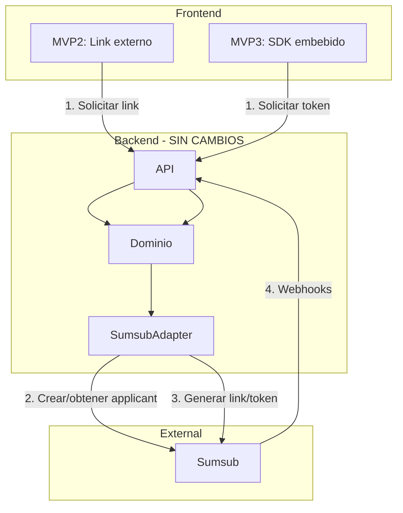

# Preparacion para MVP3 - SDK Embebido

> **Version**: 1.0.0 | **Estado**: Draft

## 1. Objetivo

Asegurar que el **contrato interno se mantiene igual** entre:
- **MVP2**: Link externo (permalink)
- **MVP3**: SDK embebido en frontend

---

## 2. Comparacion MVP2 vs MVP3

| Aspecto | MVP2 | MVP3 |
|---------|------|------|
| Permalink | ✅ Sí | ✅ Sí (sigue funcionando) |
| SDK embebido | ❌ No | ✅ Nueva opción |
| Webhooks | ✅ Igual | ✅ Igual |
| Contrato interno | ✅ Igual | ✅ Igual |
| Estados dominio | ✅ Igual | ✅ Igual |
| BD | ✅ Igual | ✅ Igual |

**MVP3 NO reemplaza el permalink**, agrega una nueva opción (SDK embebido).

---

## 3. Que se Mantiene Igual

```
┌─────────────────────────────────────────────────────────────────┐
│                    CONTRATO INTERNO (sin cambios)               │
├─────────────────────────────────────────────────────────────────┤
│                                                                  │
│  ✅ BusinessVerification (entidad)                              │
│  ✅ VerificationStatus (PENDING, IN_PROGRESS, APPROVED, etc)   │
│  ✅ IVerificationProvider (port)                                │
│  ✅ Webhooks y su procesamiento                                 │
│  ✅ Anti-duplicación e idempotencia                             │
│  ✅ Automatización de emails                                    │
│  ✅ Mapping Sumsub → Dominio                                    │
│                                                                  │
└─────────────────────────────────────────────────────────────────┘
```

### Diagrama de Arquitectura (MVP2 y MVP3)



---

## 4. Nueva Feature MVP3: SDK Embebido (Frontend)

> **Nota**: Esta es una feature ADICIONAL para frontend. El permalink sigue funcionando igual.

### 4.1 Dos formas de verificación

```
┌─────────────────────────────────────────────────────────────────┐
│                                                                  │
│  OPCION 1: Permalink (MVP2 y MVP3)                              │
│  ├── Usuario recibe link por email                              │
│  ├── Abre en navegador → redirige a Sumsub                     │
│  └── Backend: generateVerificationUrl()                         │
│                                                                  │
│  OPCION 2: SDK Embebido (solo MVP3) - NUEVA                     │
│  ├── Usuario ve verificación dentro del portal                  │
│  ├── Sin salir de la app → iframe/modal                        │
│  └── Backend: generateAccessToken() + Frontend: SDK             │
│                                                                  │
└─────────────────────────────────────────────────────────────────┘
```

### 4.2 Access Token (solo para SDK embebido)

El SDK de Sumsub requiere un **access token** para inicializarse (no puede usar permalink).

```typescript
// Nuevo método en el adapter (solo si se usa SDK embebido)
interface IVerificationProvider {
  // Existentes (MVP2 - sin cambios)
  createOrGetSubject(params: CreateSubjectParams): Promise<string>;
  generateVerificationUrl(params: GenerateUrlParams): Promise<VerificationUrlResult>;
  getVerificationStatus(providerSubjectId: string): Promise<VerificationStatus>;

  // Nuevo (MVP3 - solo para SDK embebido)
  generateAccessToken?(params: GenerateTokenParams): Promise<AccessTokenResult>;
}
```

### 4.3 Frontend: Integración del SDK

```typescript
// Solo si se implementa SDK embebido
import { SumsubWebSdk } from '@sumsub/websdk';

// 1. Backend genera access token
const { token } = await api.post('/verifications/:id/access-token');

// 2. Frontend inicializa SDK con el token
const sdk = SumsubWebSdk.init(token, {
  lang: 'es',
  onMessage: (type, payload) => { /* callbacks */ },
  onError: (error) => { /* errores */ },
});

sdk.launch('#sumsub-container');
```

### 4.4 Referencias Sumsub

| Tema | URL |
|------|-----|
| Get started with WebSDK | https://docs.sumsub.com/docs/get-started-with-web-sdk |
| Generate access token | https://docs.sumsub.com/reference/generate-access-token |
| Generate permalink | https://docs.sumsub.com/docs/generate-websdk-permalink |

---

## 5. Riesgos y Mitigaciones

| # | Riesgo | Probabilidad | Impacto | Mitigación |
|---|--------|:------------:|:-------:|------------|
| 1 | Duplicación de verificaciones | Media | Alto | Bloqueo por externalId + constraint BD |
| 2 | Webhooks perdidos | Baja | Alto | Reintentos de Sumsub + idempotencia |
| 3 | Link forwarding a terceros | Media | Crítico | TTL corto en MVP3 + device fingerprint (Sumsub) |
| 4 | Expiración silenciosa | Media | Medio | Emails de reminder + TTL largo (30d) en MVP2 |
| 5 | Multi-tenant data leak | Baja | Crítico | externalId incluye tenantId, validación en queries |
| 6 | Acoplamiento a Sumsub | Media | Medio | Contrato interno provider-agnostic |

### Mitigación de Multi-tenant

```typescript
// externalId DEBE incluir tenant para evitar colisiones
const externalId = `${tenantId}_${companyId}`;
// Ejemplo: "tenant-abc_emp-co-001"

// Todas las queries filtran por tenant
const verification = await repo.findByExternalId(externalId);
// O mejor:
const verification = await repo.findByTenantAndCompany(tenantId, companyId);
```

---

## 6. Checklist de Implementacion

### MVP2 (Link externo) - Stories

| # | Story | Descripción | Prioridad |
|---|-------|-------------|:---------:|
| 1 | Crear entidad BusinessVerification | Modelo + migraciones BD | Alta |
| 2 | Implementar SumsubAdapter | Crear applicant + generar permalink | Alta |
| 3 | Endpoint POST /verifications | Crear/obtener verificación | Alta |
| 4 | Endpoint GET /verifications/:id | Consultar estado | Alta |
| 5 | Webhook receiver | Recibir y procesar webhooks | Alta |
| 6 | Idempotencia webhooks | Tabla processed_webhooks | Alta |
| 7 | Anti-duplicación | Constraint + lógica de bloqueo | Alta |
| 8 | Job de reminders | Revisar BD + enviar a SQS | Media |
| 9 | Lambda de emails | Consumir SQS + enviar emails | Media |
| 10 | Templates de email | Diseño de emails | Media |

### MVP3 - Feature opcional: SDK Embebido (Frontend)

> Solo si se decide implementar verificación dentro del portal (sin redirección)

| # | Story | Descripción | Prioridad |
|---|-------|-------------|:---------:|
| 11 | Método generateAccessToken | Nuevo método en adapter | Media |
| 12 | Endpoint POST /verifications/:id/token | Generar token para SDK | Media |
| 13 | Integración SDK frontend | Componente React/Vue | Media |
| 14 | Manejo de token expirado | Refresh automático | Baja |
| 15 | Callbacks del SDK | Actualizar UI en tiempo real | Baja |

**Nota**: El permalink sigue siendo la opción principal. El SDK embebido es opcional.

---

## 7. Validacion de Criterios

### AC (Criterios de Aceptación)

| Criterio | Documento | Estado |
|----------|-----------|:------:|
| Arquitectura MVP2 + MVP3 | Este documento | ✅ |
| Contrato interno + estados | DOMAIN-MODEL-KYB.md | ✅ |
| Mapping Sumsub → Dominio | DOMAIN-MODEL-KYB.md, SINCRONIZACION-WEBHOOKS.md | ✅ |
| Webhooks + idempotencia | SINCRONIZACION-WEBHOOKS.md, ANTI-DUPLICACION.md | ✅ |
| Comportamiento link | LINK-BEHAVIOR.md | ✅ |
| Reglas de bloqueo | ANTI-DUPLICACION.md | ✅ |
| Disparadores email | EMAIL-AUTOMATION.md | ✅ |

### DOR (Definition of Ready)

| Criterio | Estado | Nota |
|----------|:------:|------|
| Acceso a sandbox Sumsub | ✅ | Validado en pruebas |
| Claridad de entidades | ✅ | Solo empresa (sin UBOs por ahora) |
| Unidad de verificación | ✅ | Por empresa (externalId) |
| Identificador estable | ✅ | externalId = tenantId_companyId |

### DOD (Definition of Done)

| Criterio | Documento |
|----------|-----------|
| Diagrama | Este documento (sección 3) |
| Contrato | DOMAIN-MODEL-KYB.md |
| Mapping | DOMAIN-MODEL-KYB.md, SINCRONIZACION-WEBHOOKS.md |
| Sincronización | SINCRONIZACION-WEBHOOKS.md |
| Reintentos/duplicados | ANTI-DUPLICACION.md |
| Link expirado/reanudación | LINK-BEHAVIOR.md |
| Riesgos y mitigaciones | Este documento (sección 5) |
| Checklist implementación | Este documento (sección 6) |

---

## 8. Documentos del Spike

| Documento | Contenido |
|-----------|-----------|
| DOMAIN-MODEL-KYB.md | Entidad, estados, contrato interno, mapeo |
| ANTI-DUPLICACION.md | Reglas de bloqueo, idempotencia |
| SINCRONIZACION-WEBHOOKS.md | Webhooks, validación, procesamiento |
| LINK-BEHAVIOR.md | TTL, expiración, reanudación |
| EMAIL-AUTOMATION.md | Disparadores, ventanas, arquitectura |
| MVP3-PREPARACION.md | Comparación, riesgos, checklist |
