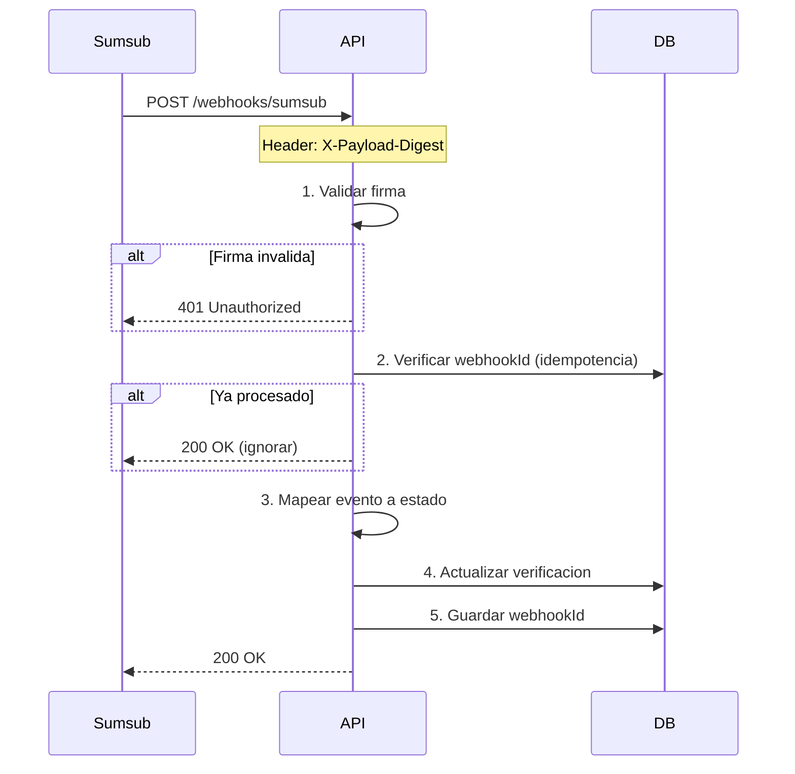

# Mecanismo de Sincronizacion - Webhooks KYB

> **Version**: 1.0.0 | **Estado**: Draft

## 1. Resumen

Sumsub notifica cambios de estado via webhooks. Nosotros escuchamos y actualizamos el estado interno.

```
Sumsub ──webhook──> API ──update──> BD
```

---

## 2. Comparacion: Sincrono vs Asincrono

| Aspecto | Sincrono | Asincrono (cola) |
|---------|----------|------------------|
| **Complejidad** | Simple - 1 endpoint | Endpoint + worker + cola |
| **Latencia respuesta** | Depende del proceso | Siempre rapido |
| **Tolerancia a fallos** | Sumsub reintenta | Cola retiene y reintenta |
| **Volumen** | Bajo-medio (~100/dia) | Alto (miles/dia) |
| **Infraestructura** | Solo API | API + Redis/SQS + Worker |

**Decision: Sincrono** - volumen bajo, procesamiento simple (solo actualizar BD).

---

## 3. Eventos de Sumsub

| Evento | Cuando se dispara | Estado Dominio |
|--------|-------------------|----------------|
| `applicantCreated` | Applicant creado en Sumsub | `PENDING` |
| `applicantPending` | Usuario envio documentos | `IN_PROGRESS` |
| `applicantPrechecked` | Pre-verificacion automatica | `IN_PROGRESS` |
| `applicantOnHold` | En revision manual | `IN_PROGRESS` |
| `applicantReviewed` | Revision completada | Ver resultado |

### Resultado de `applicantReviewed`

| reviewAnswer | rejectType | Estado Dominio |
|--------------|------------|----------------|
| `GREEN` | - | `APPROVED` |
| `RED` | `FINAL` | `REJECTED` |
| `RED` | `RETRY` | `IN_PROGRESS` (puede reintentar) |

---

## 4. Validacion de Firma

Sumsub firma cada webhook con HMAC-SHA256. **Siempre validar.**

```typescript
import crypto from 'crypto';

function validateSignature(payload: string, signature: string, secretKey: string): boolean {
  const expectedSignature = crypto
    .createHmac('sha256', secretKey)
    .update(payload)
    .digest('hex');

  return crypto.timingSafeEqual(
    Buffer.from(signature),
    Buffer.from(expectedSignature)
  );
}
```

### Header de firma
```
X-Payload-Digest: <HMAC-SHA256 hex>
```

---

## 5. Flujo del Webhook



---

## 6. Estructura del Payload

```typescript
interface SumsubWebhook {
  // Identificadores
  applicantId: string;           // ID en Sumsub
  externalUserId: string;        // Nuestro externalId
  correlationId: string;         // ID unico del evento (para idempotencia)

  // Evento
  type: WebhookType;             // 'applicantReviewed', etc.
  reviewStatus: string;          // 'completed', 'pending', etc.

  // Resultado (solo en applicantReviewed)
  reviewResult?: {
    reviewAnswer: 'GREEN' | 'RED';
    rejectLabels?: string[];
    reviewRejectType?: 'FINAL' | 'RETRY';
  };

  // Metadata
  createdAtMs: number;
  sandboxMode: boolean;
}

type WebhookType =
  | 'applicantCreated'
  | 'applicantPending'
  | 'applicantPrechecked'
  | 'applicantOnHold'
  | 'applicantReviewed';
```

---

## 7. Implementacion

```typescript
async function handleWebhook(req: Request): Promise<Response> {
  const payload = await req.text();
  const signature = req.headers.get('X-Payload-Digest');

  // 1. Validar firma
  if (!validateSignature(payload, signature, SUMSUB_SECRET_KEY)) {
    return new Response('Invalid signature', { status: 401 });
  }

  const data: SumsubWebhook = JSON.parse(payload);
  const webhookId = data.correlationId || `${data.applicantId}_${data.type}_${data.createdAtMs}`;

  // 2. Idempotencia
  if (await webhookRepo.exists(webhookId)) {
    return new Response('OK', { status: 200 }); // Ya procesado
  }

  // 3. Mapear estado
  const status = mapWebhookToStatus(data);

  // 4. Actualizar verificacion
  await verificationRepo.updateByExternalId(data.externalUserId, {
    status,
    providerSubjectId: data.applicantId,
    updatedAt: new Date(),
    ...(status === 'APPROVED' || status === 'REJECTED' ? { completedAt: new Date() } : {})
  });

  // 5. Guardar webhook procesado
  await webhookRepo.save({ webhookId, externalId: data.externalUserId, type: data.type });

  return new Response('OK', { status: 200 });
}

function mapWebhookToStatus(data: SumsubWebhook): VerificationStatus {
  switch (data.type) {
    case 'applicantCreated':
      return 'PENDING';

    case 'applicantPending':
    case 'applicantPrechecked':
    case 'applicantOnHold':
      return 'IN_PROGRESS';

    case 'applicantReviewed':
      if (data.reviewResult?.reviewAnswer === 'GREEN') {
        return 'APPROVED';
      }
      if (data.reviewResult?.reviewRejectType === 'FINAL') {
        return 'REJECTED';
      }
      return 'IN_PROGRESS'; // RETRY - puede corregir

    default:
      return 'IN_PROGRESS';
  }
}
```

---

## 8. Configuracion en Sumsub Dashboard

```
Dashboard → Webhooks → Add webhook

URL:          https://api.tudominio.com/webhooks/sumsub
Secret:       [tu-secret-key]
Events:       applicantCreated, applicantPending, applicantReviewed
Applicants:   company (solo KYB)
```

---

## 9. Respuestas y Reintentos

| Response | Significado | Accion Sumsub |
|----------|-------------|---------------|
| `200` | Procesado OK | Marca como entregado |
| `4xx` | Error cliente | No reintenta |
| `5xx` | Error servidor | Reintenta (backoff exponencial) |
| Timeout | Sin respuesta | Reintenta |

**Timeout de Sumsub**: 10 segundos para responder.

---

## 10. Resumen

| Aspecto | Valor |
|---------|-------|
| Endpoint | `POST /webhooks/sumsub` |
| Procesamiento | Sincrono |
| Validacion | HMAC-SHA256 (X-Payload-Digest) |
| Idempotencia | Por `correlationId` |
| Eventos | Todos (created, pending, reviewed) |
| Timeout | Responder en < 10s |
